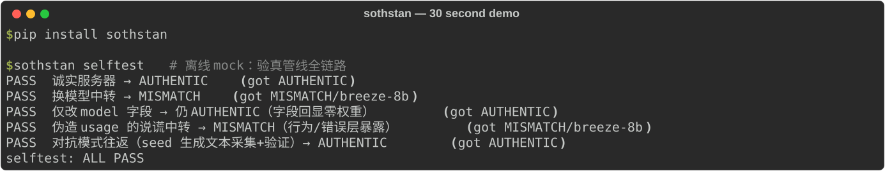

# The Trial of the Hidden Voice — Sothstan

[简体中文](README.md) · English

**Sothstan** helps you audit whether an OpenAI-compatible API behaves like the model its endpoint claims to serve. It compares observed signals against trusted baselines and reports statistical evidence with a reproducible record.

[](https://pypi.org/project/sothstan/)
[](https://pypi.org/project/sothstan/)
[](https://github.com/cloudydreamland/TheTrialOfTheHiddenVoice/actions/workflows/ci.yml)
[](LICENSE)


## Try the offline demo

```bash
python -m pip install sothstan
```

Or install from source (latest development version):

```bash
git clone https://github.com/cloudydreamland/TheTrialOfTheHiddenVoice.git
cd TheTrialOfTheHiddenVoice
python -m pip install .
```

The self-test uses local mock endpoints. It demonstrates matching behavior, model substitution, a spoofed model-name field, and misleading usage data without sending requests to a real provider.

## Audit a real endpoint

Collect a baseline from endpoints you trust. Keep the probe settings and adversarial seed consistent between collection and checking.

```bash
sothstan collect https://api.example.com/v1 \
  --model model-a --family family-a \
  --out baselines/model-a.json --api-key-env PROVIDER_API_KEY

sothstan check https://relay.example.com/v1 \
  --model model-a --api-key-env RELAY_API_KEY
```

For comparable results, include competing models from the same family in the baseline set. Never put API keys in shell history, baseline files, or reports.

## How it works

Sothstan collects several endpoint signals, compares the claimed model with competing baselines, and returns `AUTHENTIC`, `SUSPICIOUS`, `MISMATCH`, or `INCONCLUSIVE`. The response's self-reported model name is displayed but is not treated as identity evidence.

## Important limits

- A verdict is statistical evidence, not cryptographic proof of model weights or operator identity.
- The included demo baselines describe mock models; they are not real provider baselines.
- A useful audit needs current, trusted baselines and representative competing models.
- Endpoints may change over time or adapt to probes. Reports should include sample settings, time, and baseline provenance.
- Real endpoint calls can incur cost. Set a budget and review the probes before running them.

## Documentation

- [简体中文](README.md)
- [Adversarial evaluation matrix](benchmarks/evasion_matrix.md)
- [Limitations and evaluation boundaries](#important-limits)
- [Changelog](CHANGELOG.md)
- [Roadmap](ROADMAP.md)
- [Research notes](GAP_PROOF.md)

## Development and security

See [CONTRIBUTING.md](CONTRIBUTING.md). Please report security issues privately; see [SECURITY.md](SECURITY.md).

## Feedback and contributing

Use [Discussions](https://github.com/cloudydreamland/TheTrialOfTheHiddenVoice/discussions) for questions and ideas, and [Issues](https://github.com/cloudydreamland/TheTrialOfTheHiddenVoice/issues) for reproducible bugs. Share only synthetic or redacted minimal examples; never upload personal data, API keys, or private source text. Report security issues privately as described in [SECURITY.md](SECURITY.md).

## License

MIT. See [LICENSE](LICENSE).
